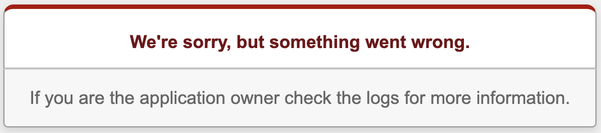

# Part 0.A - Preparing to Deploy To Heroku

## Initial Heroku Deployment

> [!TIP]
> While this "Part" is listed as 0.A, you will want to ensure you have cloned the git repo for this CHIP prior to doing
> any of this work. Once cloned, you can set up your new Heroku app, push the codebase to Heroku and set up the
> use of the database (all of this is detailed below). Then you can and should proceed with the work in the rest of
> the chip.

Log in to your Heroku account by typing the command: `heroku login -i` in the terminal. Provide your nyu.edu 
(or approved alternative) email but when it asks for a password, instead you must find your **API Key** from the 
bottom of the [Account Settings page on Heroku](https://dashboard.heroku.com/account). Copy and paste this value 
in for the password.

For CHIPS 5.3, you will need to complete the Heroku deployment to your own individual Heroku app. 

Use the Heroku CLI (as you have in prior CHIPS) to create a new Heroku app for this CHIP. Once created, add Heroku to 
your local git repo as a remote named `heroku`, as we have done in the past, so you can deploy to the app.

```bash
heroku create hw-rails-intro
```

A "stack" is a term that describes the operating system and default software that you application is running on. 
Heroku has a [large set of stacks](https://devcenter.heroku.com/articles/stack) you can select from. In this case, `heroku-24` (the default stack) includes 
the correct versions of Rails.

Now, push your `main` branch to the Heroku remote's `main` branch:

```bash
git push heroku main
```

(You may see the following warning the first time - it's fine. Answer "yes", and in the future you shouldn't see it anymore:)

    The authenticity of host 'heroku.com (50.19.85.132)' can't be established.
    RSA key fingerprint is 8b:48:5e:67:0e:c9:16:47:32:f2:87:0c:1f:c8:60:ad.
    Are you sure you want to continue connecting (yes/no)?
    Please type 'yes' or 'no':

Is the app running on Heroku? If you navigate to the Heroku URL that is printed above the blue text at the end of the 
results from `git push Heroku main` you will likely see error messages. This is due to the fact that the database
has not been created and associated with the app in Heroku. Let's address that next.

Create a postrgesql database and attach it to the web application as follows:

```bash
heroku addons:add heroku-postgresql:essential-0 -a hw-rails-intro
```

Notice the `heroku-postgresql:essential-0` designation. We are using the simplest, cheapest database that we need. Other
options exist, depending on your tolerance for downtime, the cost, etc. You can read about these options on
Heroku's documentation on the [Heroku-Postgresql AddOn](https://elements.heroku.com/addons/heroku-postgresql).
Different offerings have different levels of service (including how much data you can store).

Once you add the database to the app, you should see some output confirming the creation and attachment to the app:

```bash
Creating heroku-postgresql:essential-0 on ⬢ hw-rails-intro... ~$0.007/hour (max $5/month)
Database should be available soon
postgresql-shallow-18724 is being created in the background. The app will restart when complete...
Use heroku addons:info postgresql-shallow-18724 to check creation progress
Use heroku addons:docs heroku-postgresql to view documentation
```

You can also check the status of the database creation and attachment via the Heroku dashboard.

> [!TIP]
> As you can see we are using the Heroku CLI quite a bit.  There are many, many more operations that can be performed
> on Heroku. Try investigating via `heroku --help` to see the commands. But for any command, additional help is available
> (e.g., `heroku addons --help`).

If we again check our app via a web browser, we should see an error message... but it's not overly helpful:


We will save you the pain of going through the logs, but perhaps you can guess what else needs to be done at this point.
While we have a database, we have not yet performed a migration to get the database ready for our app. We should also 
seed the database with some initial data.  So next, do the following:

```bash
heroku run bundle exec rails db:migrate
heroku run bundle exec rails db:seed
```

If all went well, you should see output that looks like this:
```bash
ENG-pd80-MBP01:hw-rails-intro peterdepasquale$ heroku run bundle exec rails db:migrate
Running bundle exec rails db:migrate on ⬢ hw-rails-intro... up, run.3649
I, [2026-02-23T23:25:46.139409 #2]  INFO -- : Migrating to CreateMovies (20250702121840)
== 20250702121840 CreateMovies: migrating =====================================
-- create_table(:movies)
   -> 0.0153s
== 20250702121840 CreateMovies: migrated (0.0154s) ============================

ENG-pd80-MBP01:hw-rails-intro peterdepasquale$ heroku run bundle exec rails db:seed
Running bundle exec rails db:seed on ⬢ hw-rails-intro... up, run.7435
ENG-pd80-MBP01:hw-rails-intro peterdepasquale$
```

Now you should be able to navigate to your app's URL.

**Note:** don't proceed past this point until you are able to complete the above successfully, or you won't be able 
to receive a grade for this assignment!

## Next
[Part 1 - Filter The Movies List By Rating](Part-1-Filter-Movies-List-By-Rating.md)