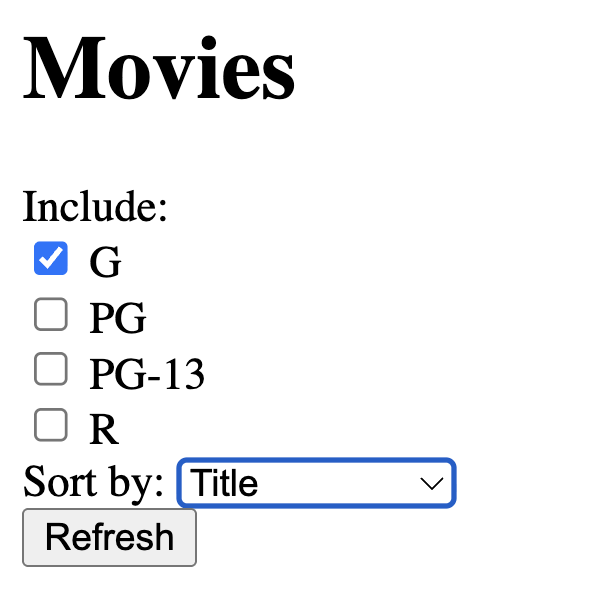

# Part 2 - Sort The Movie List

First, let's make another new feature branch for the next step. This time, we're adding a sorting functionality, so
consider naming your branch something relevant to the feature you'll be implementing.

```bash
git checkout -b <NEW_BRANCH_NAME>
```

On the list of all movies page, add a drop-down with "Title" and "Release Date" as options. Selecting one of them and 
clicking the Refresh button should cause the list to be reloaded but sorted in ascending order on that column. For 
example, using the "release date" column should redisplay the list of movies with the earliest-released movies first; 
using the "title" header should list the movies alphabetically by title. (For movies whose names begin with 
non-letters, the sort order should match the behavior of `String#<=>`.) You can add this code right before the 
submit tag:

```erb
<div>
    <label class="form-label me-2" for="sort_by">Sort by:</label>
    <%= select_tag :sort_by,
                   options_for_select([["Title", "title"],
                                       ["Release Date", "release_date"]],
                                       @sort_by),
                   id:    "sort_by",
                   class: "form-select d-inline w-auto" %>
</div>
```

When the listing page is redisplayed with sorting-on-a-column enabled, the column header that was selected for 
sorting should appear in the drop-down.

The result should look something like this:



> [!NOTE]
> Initially, you will probably find that when you click on a sort column, the app will "forget" which checkboxes have 
> been checked. Similarly, when you sort on a column, but then you change which checkboxes are checked, the app will 
> "forget" the desired sort order. We will fix these cases later.

**IMPORTANT for grading purposes:**

* As in the code above, your select tag should have the id `sort_by` and the form submit button for filtering by 
ratings should have the id `ratings_submit`.
* Both pieces of the provided code, Part 1 and Part 2 of this assignment, should be placed inside the same `form_tag`.

> [!TIP]
> **Adding parameters to existing RESTful routes**
> 
> The current RottenPotatoes views use the Rails-provided "resource-based routes" helper `movies_path` to generate the 
> correct URI for the movies index page. You may find it helpful to know that if you pass this helper method a hash of 
> additional parameters, those parameters will be parsed by Rails and available in the `params[]` hash. To play around 
> with this behavior, you can 
> [test out routes in the Rails console](https://stackoverflow.com/questions/1397644/testing-routes-in-the-console). 
> (How did I find this secret information? I Googled "test routes in rails console"!)
> 
> So, when you are converting those column headers into clickable links (for which it's best to use the `link_to` 
> helper) that point to the RESTful route for fetching the movie list (best done using the route helper 
> `movies_path()`, think about how you might modify the call that generates the route helper in order to include 
> information visible in `params` that would tell you which column header was clicked. 

> [!TIP]
> Remember that every parameter in a route has a key and a value, so any argument you pass to `movies_path` 
> would have to be a hash.

> [!TIP]
> **Displaying things in the right order**
> 
> Databases are pretty good at returning collections of rows in sorted order according to one or more attributes. 
> Before you rush to sort the collection returned from the database, look at the 
> [documentation](https://api.rubyonrails.org) for `ActiveRecord.order` and see if you can get the database to do 
> the work for you.
> 
> Don't put logic in your views! The view shouldn't have to sort the collection itself—its job is just to show stuff. 
> The controller should spoon-feed the view exactly what is to be displayed.

## Remembering both the sort order and filtering order

At this point, you should have sort columns working, but you probably noticed that sorting on a column "forgets" the 
values of which checkboxes were checked. Let's fix that.

The key to fixing it is to remember that when we constructed the form for the checkboxes in Part 1, the only thing that 
was needed to pass to the controller was the info about which checkboxes were checked. For example, if the boxes whose 
field names were `ratings_G` and `ratings_PG` were checked, `params[:ratings]` would contain a hash 
`{'G': '1', 'PG': '1'}`. (HTML allows a checked box to be given any value, but we chose "1" which is conventional since 
the value is usually irrelevant, since if the checkbox is not checked, it doesn't appear in the submitted form values 
at all.)

So if we could _also_ include this info in the link when the user clicks a column name, the info would be passed into 
the controller action along with the column name itself!

Now, the view already knows that the value `@ratings_to_show` is an array containing only the values for the boxes that 
were checked--for example, something like `['G','R']`. But to make it look right for `params`, we need to pass 
`movies_path()` something that looks more like `{'G':'1', 'R':'1'}` (or really, any value other than `'1'` is fine, 
since it's just the presence of the key that matters).

Judiciously using a search engine or AI, find and test a concise way to derive a hash whose keys are the values of an 
array, and whose value for all the keys is some constant like `'1'`. With that in hand, modify the arguments to the 
`movies_path()` route helper already used by your column headers to include that hash, such that the information about 
which checkboxes were checked on the form appears as part of the route.

At this point, you should be able to refresh the view by _either_ clicking on a column header _or_ clicking the 
Refresh button, and both types of changes should be "remembered".

There is a minor corner case though—changing the checkbox filters and then clicking on a column header (instead of the 
submit button) should **not** cause the changes to ratings filters be "remembered" and should not result in the 
checkbox filter changing when the page is refreshed.

## Deploying again

We could use the same strategy as the last part to deploy. This time, though, let's do it without a pull request. 
Pull requests are great, but it's good to see how branch merging works straight from the command line, rather than 
always relying on the big green button in GitHub to make a merge commit for you.

First, stage your changes and commit them to the feature branch you created. Then, check out your `main` branch:

```bash
git checkout main
```

When you're about to merge one branch into another, it's always good practice to start by making sure your target 
branch is up to date with the remote:

```bash
git pull origin main
```

Of course, you won't have any new changes on `main` to pull, since there's no one else making changes to the 
repository right now. Still, it's good to get in the habit of checking that you're up-to-date with the remote! Even 
on solo projects, it's easy to get tripped up by working on multiple computers.

Now, let's manually merge the new feature branch into `main`. This is what GitHub is doing when you press the "Merge 
pull request" button.

```bash
git merge <FEATURE_BRANCH_NAME>
```

<details>
  <summary><strong>Self Check Question:</strong> What would happen if, while you were working on your feature branch, someone else had made changes to the <code>main</code> branch of the remote on the same parts of the same files you just edited?</summary>
  <p><blockquote>This is where the dreaded <em>merge conflict</em> comes from. When you run <code>git merge</code>, Git will check whether your changes conflict with changes made in the branch you're merging into. If there are conflicts, you'll be asked to resolve those conflicts yourself before committing the merge. Fortunately, in this homework, <code>main</code> hasn't been updated since you created your feature branch off the <code>main</code> branch, so merging will be a breeze.</blockquote></p>
</details>

This will update the `main` branch to include the commits from your feature branch. Now, you can delete the feature 
branch and push `main` to the remote:

```bash
git branch -d <FEATURE_BRANCH_NAME>
git push origin main
```

Again, when you're merging into `main`, it's typically better to use the pull request flow; we used the manual merge 
technique here just to give you a peek under the hood. One risk of doing the merge-to-main process yourself is that 
things get messy if two people try to merge their feature branches into `main` at the same time. Git's distributed 
nature, with a copy of the repository on each system, means there's nothing preventing two people from making changes 
to the `main` branch at the same time. GitHub's merge button will quickly perform the merges in sequence for you, 
applying one at a time to prevent this issue.

Now that we've got our code on the `main` branch, we can once again deploy our `main` branch to Heroku:

```bash
git push heroku main
```

Check that it's working on the Heroku site!

## Next
[Part 3 - Remember The Sorting And Filtering Settings](Part-3-Remember-The-Sorting-Filtering-Settings.md)